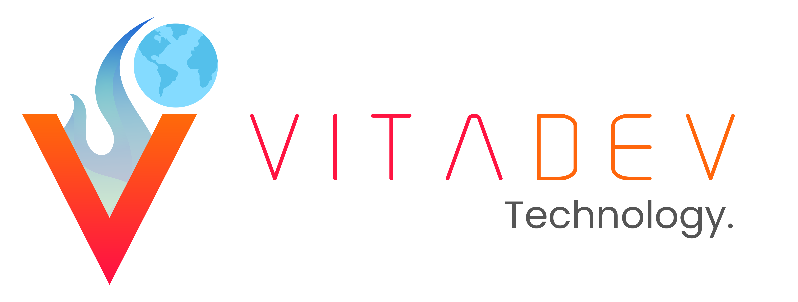

  

###

<h1 align="center">Bem-Vindos à Vitadev!</h1>

###

Nossa empresa foi fundada em 2023 visando ajudar pessoas e empresas a criar uma presença forte na internet. Acreditamos que uma presença digital forte é crucial para o sucesso nos negócios atualmente e estamos aqui para ajudar nossos clientes a alcançarem esse objetivo.    Na Vitadev, nossa motivação é oferecer sempre o melhor produto e estratégia personalizada para todo tipo de empresa ou negócio. Sabemos que cada empresa é única, com suas próprias necessidades e objetivos, por isso trabalhamos de perto com nossos clientes para entender seus desafios e criar soluções sob medida para suas necessidades específicas.    Com nossa equipe de especialistas, estamos comprometidos em ajudar nossos clientes a alcançar o sucesso em suas estratégias. Oferecemos uma ampla gama de serviços, incluindo otimização de mecanismos de pesquisa (SEO), publicidade e gerenciamento de mídias sociais, criação de conteúdo e muito mais.    Não importa o tamanho ou setor do seu negócio, estamos aqui para ajudar. Entre em contato conosco para saber como podemos ajudá-lo a alcançar seus objetivos de marketing digital e criar uma presença forte na internet. 

###

  
   
  

###

<h2 align="center">Siga nossa página nas redes sociais.</h2>

###

  
  
  
  

###
